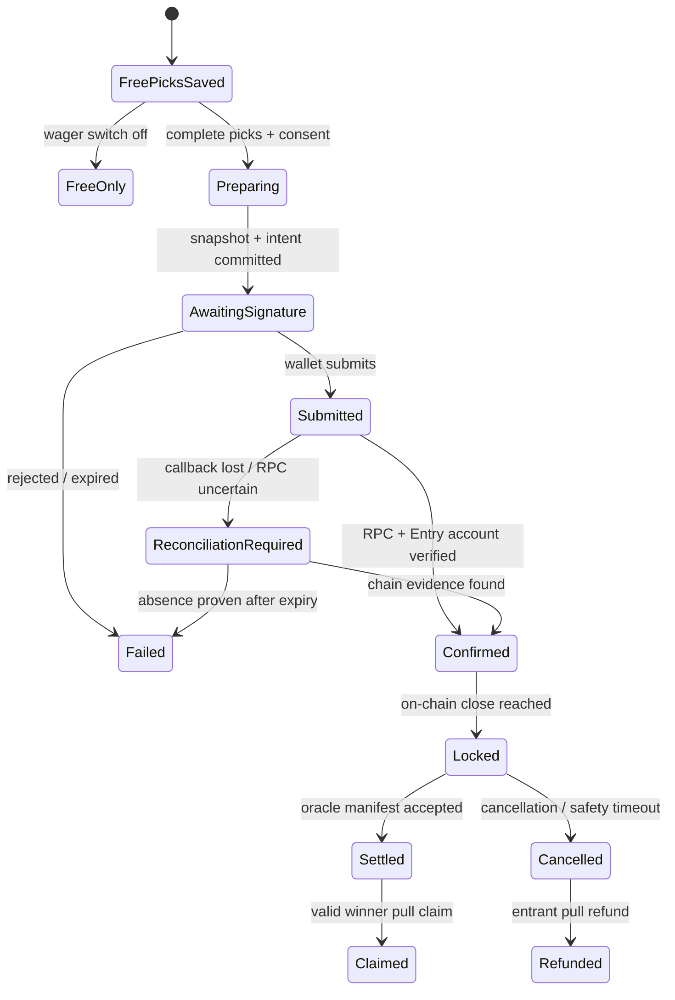

## Context

Winscore currently models one mutable `predictions` row per user and match, locked by Postgres RLS at `matches.kickoff_at`. Final results are written to `matches`; `public.compute_match_scores` writes `scores`; `lib/scoring.ts` mirrors that formula for tests. Private pools reuse `groups`, belong to exactly one `competition_id`, and rank members through `leaderboard_for_group` by total points descending, exact hits descending, winner-plus-goal-difference hits descending, then `min(predictions.submitted_at)` ascending. The SQL uses `rank()`, so members that remain equal on every key share a rank.

There is no persistent league matchday entity. The existing match list's browser-local calendar buckets are presentation only and cannot identify a wager. There is also no Solana toolchain or dependency in the repository today. At proposal time the repository uses Next.js 16.2.11, React 19.2.8, Supabase/Postgres with RLS, Tailwind 4, shadcn/ui, `next-intl`, and Vercel.

The feature crosses two consistency domains. Supabase remains the application, membership, prediction, sports-result, and operational source of truth. A Solana program holds SPL tokens and enforces deposit/claim/refund accounting. No atomic transaction spans them, so every boundary must be durable, idempotent, and reconcilable.

Official Solana pages reviewed for this proposal currently direct new frontend work toward `@solana/kit`, `@solana/react`, plugins, Wallet Standard, checked token transfers, PDAs, and dedicated production RPC infrastructure. Registry inspection on 2026-07-22 found `@solana/kit` and `@solana/react` 7.0.0, `@solana/client` 1.7.0, and `@solana-program/token` 0.15.0; exact mutually compatible versions will be pinned only after an implementation spike. Rust 1.96 is installed, while the Solana and Anchor CLIs are not.

The human-facing design serves pool members completing a matchday sheet, often on mobile near kickoff. It must feel like Winscore's fixture board rather than a crypto terminal: free picks are the main path; the wager is a clearly separated, default-off rail. Pitch green, fixture-paper surfaces, ink, referee amber, goal-line red, and an unmistakable Devnet blue carry semantic meaning. The signature element is a single round match sheet whose wager rail progresses from optional consent through immutable snapshot to an auditable receipt.

Stakeholders include players, pool owners, competition administrators, settlement operators, support/on-call staff, security reviewers, and legal/compliance reviewers. Mainnet users and real-value funds are explicitly outside this change.

## Goals / Non-Goals

**Goals:**

- Preserve free prediction creation and editing as the independent, default behavior even when wallet, RPC, or program operations fail.
- Introduce stable round identity, explicit fixture assignment, and an authoritative server/on-chain close boundary.
- Prove wallet ownership, snapshot complete wager picks immutably, and bind their deterministic commitment to one on-chain entry.
- Custody one approved Devnet SPL token in deterministic program-controlled escrow without an arbitrary withdrawal path or platform fee.
- Share the existing scoring formula and canonical pool tie-break semantics, then distribute the entire integer pot deterministically among rank-1 winners.
- Make deposit, settlement, claim, cancellation, and refund workflows durable, idempotent, observable, and recoverable.
- Keep sensitive reads and writes behind Supabase RLS plus server-side authentication/authorization, with small client islands only for Wallet Standard and signing.
- Ship accessible, localized, truthful UI and operational documentation, with explicit oracle trust and Mainnet blockers.

**Non-Goals:**

- Mainnet deployment, real-value activation, legal approval, or a conclusion that wagering is lawful in any jurisdiction.
- Multiple mints, freely entered mints, variable stakes per participant, per-match wagers, odds, a house edge, platform fees, secondary markets, or custodial backend wallets.
- Replacing Supabase Auth with wallet authentication or exposing secret/service-role credentials to the browser.
- Trustless sports results. Winscore remains an authorized off-chain oracle and settlement authority.
- Editing an on-chain settlement after it becomes final. Corrections after settlement follow an incident process, not a fictional chain rewrite.
- Inferring rounds from dates, ISO weeks, or temporal proximity.

## Decisions

### 1. Model a round explicitly and assign each match to exactly one round

Add `competition_rounds` with `id`, `competition_id`, stable `round_key`, optional `round_number`, localized labels, `display_order`, `opens_at`, optional earlier `admin_closes_at`, lifecycle status, provider metadata/review status, and timestamps. Enforce uniqueness on `(competition_id, round_key)` and `(id, competition_id)`. Add nullable `matches.round_id` during backfill, then use a composite foreign key `(round_id, competition_id)` to prevent cross-competition assignment. One match belongs to at most one competition round.

The effective entry close is `least(admin_closes_at, min(kickoff_at))`, ignoring cancelled fixtures and using the database clock. A round with no eligible assigned fixture cannot accept wager initialization or entry. The persisted `wager_rounds.closes_at` is the value committed on-chain.

If a provider moves the earliest kickoff earlier after initialization, the program supports an authority-signed `shorten_close` transition that can only reduce the timestamp; the reconciler invokes it. A later kickoff never extends an initialized close. Assignment changes after deposits require cancellation/refund rather than silently changing the wager's fixture set.

Provider adapters carry a provider round key when reliable. Unmapped, conflicting, or changed provider values create a review record/status surfaced to admins; they never trigger date-based guessing. Admin tooling creates/edits rounds, assigns fixtures, validates completeness, and records audited corrections.

Alternatives considered: date/ISO-week grouping is invalid for postponed and cross-midnight fixtures; a many-to-many relation adds ambiguity that current sports and wager rules do not need.

### 2. Keep pool configuration separate, default-off, and deployment-constrained

Add one `group_wager_configs` row per existing `groups` row only when an owner configures wagering. It stores `enabled`, fixed `stake_base_units`, approved mint bytes, token-program bytes, verified decimals, cluster, limits/eligibility policy references, and timestamps. Creation and updates occur through owner-authorized database functions; ordinary members receive read-only configuration appropriate to the pool.

The deployment defines one allowed mint and program. The server fetches and validates the mint account, decimals, owner program, authorities, and extensions from RPC before accepting configuration; browser input never supplies an arbitrary mint. MVP accepts the classic SPL Token program. Token-2022 and extensions affecting transferred amount or authority are rejected until deliberately supported.

Changing mint, token program, decimals, or stake affects only rounds not yet initialized. Existing wager rounds retain an immutable configuration snapshot. Disabling new wagers does not disable claims or refunds.

Alternative considered: columns directly on `groups` make lifecycle/versioning and RLS harder and populate all free pools with blockchain fields.

### 3. Save free picks and begin a wager as separate committed operations

The round sheet first calls the normal authenticated prediction mutation, upserting each eligible match under the existing per-match RLS and kickoff locks. Its success is returned immediately and is never rolled back by subsequent wallet work. If the default-off wager switch remains off, the flow ends without loading wallet code or making RPC calls.

If wagering is selected, a second authenticated operation calls a hardened Postgres function. Under row locks it re-reads membership, wager configuration, round assignments, server-derived close, and all current predictions; rejects missing/late/ineligible inputs; copies the exact picks plus original `submitted_at` values to `wager_entry_predictions`; and creates a `wager_intent` with a unique UUID and idempotency key. The snapshot and intent commit atomically.

The snapshot is canonicalized as RFC 8785 JSON with a version, group UUID, round UUID, user UUID, and match records sorted by UUID bytes. Scores are non-negative integers and timestamps use normalized UTC strings. SHA-256 of the UTF-8 canonical bytes is `pick_commitment`. Persist the canonicalization version and commitment; reconstruct and test the bytes in TypeScript and SQL fixtures. On-chain stores only the 32-byte commitment and intent identity hash, not picks or personal data.

Free `predictions` may still change for matches that have not kicked off. Wager scoring reads only `wager_entry_predictions`; the UI labels this distinction before signing and on the receipt.

Alternative considered: freezing the normal predictions would change free-play rules; a single cross-system submission would incorrectly make free saves depend on wallet/RPC success.

### 4. Prove wallet control with a one-time signed-message challenge

Wallet Standard discovery only selects an address. An authenticated Route Handler issues a cryptographically random challenge containing a versioned domain, Supabase user ID, 32-byte wallet address, `devnet`, issued-at, expiry, and nonce. The challenge row stores a hash/structured fields, expires quickly, and is single-use.

A small Client Component asks the wallet to sign the exact UTF-8 message. The server verifies Ed25519 bytes, exact message reconstruction, domain, current user, address, cluster, expiry, and atomic nonce consumption before inserting `wallet_links`. A unique active address constraint ensures one wallet belongs to at most one active user. Unlinking is denied while an entry, claim, refund, or reconciliation state still requires that link.

Store public keys as canonical 32-byte `bytea` and signatures as 64-byte `bytea`; encode Base58 only at UI/RPC boundaries. Never log complete challenges/signatures, request seed phrases, or treat wallet presence as authentication.

Alternative considered: connect-only linking does not prove control; transaction-only proof would couple identity setup to spending.

### 5. Use an Anchor-based, versioned Rust escrow program after a compatibility gate

Create a dedicated Rust workspace and Anchor program because typed account constraints, PDA checks, IDL generation, and local-validator testing reduce the risk of hand-written account validation. Before scaffolding, install and pin current compatible Solana/Anchor versions using official documentation; failure of that spike blocks program work and triggers a design update rather than an unreviewed framework switch.

Core PDAs use stable byte seeds and a program schema version:

- wager round: `['wager-round', version, group_uuid_bytes, round_uuid_bytes]`
- entry: `['entry', wager_round_pubkey, entrant_wallet]`
- claim: `['claim', wager_round_pubkey, winner_wallet]`
- vault: the checked associated token account owned by the wager-round PDA

`initialize_wager_round` records group/round IDs, approved mint and token program, decimals, exact `u64` stake, close, refund timeout, settlement authority, manifest version, and rent recipient. `enter` requires the wallet signer, expected entry PDA, intent identity hash, unique entry, exact commitment, and `TransferChecked` for exactly the stake. It increments totals with checked arithmetic only after transfer success. Account sizes and participant/stake limits are explicit.

`lock` is permissionless once the on-chain clock reaches close; `enter` independently rejects at or after close. `shorten_close` can only decrease close before settlement. `settle` is authority-only, once, after lock; it records result-manifest hash, Merkle root, total distributable, and winner count, and requires total distributable to equal the vault's tracked deposited amount. `claim` verifies a domain-separated Merkle leaf/proof, recipient wallet, integer award, and claim PDA, then transfers once. `cancel_and_refund` is authority-controlled before settlement or permissionless after the immutable safety timeout; `refund` returns exactly one stake per entry once and is mutually exclusive with claims. `close` requires zero token liability and closes accounts/rent to immutable original rent recipients.

There is no instruction that transfers arbitrary token amounts to an administrator. Mint, token program, PDAs, authority, close, state transition, balances, and all arithmetic are verified on-chain. Replayed transitions either return a documented already-complete result off-chain or fail with a stable program error without moving tokens.

Alternative considered: a backend-controlled token account is custodial and permits unilateral withdrawal; a frontend-only transfer lacks enforceable settlement and replay invariants.

### 6. Treat Postgres/Solana entry as an explicit state machine and verify the chain independently

`wager_intents` uses states `preparing`, `awaiting_signature`, `submitted`, `confirmed`, `failed`, `expired`, and `reconciliation_required`. `wager_entries` represents verified chain facts, not optimistic client state. `wager_chain_events` is an append-only normalized ledger keyed by signature/instruction/event identity.

After intent creation, the server lazily initializes the Solana SDK, revalidates trusted database/configuration values, gets a recent blockhash, and builds the exact entry transaction. The client signs and submits through Wallet Standard and returns only the signature/status hint. The server queries configured Devnet RPC and validates cluster, confirmation/finality policy, successful execution, program ID, decoded instruction, expected PDAs, wallet signer, mint, token program, stake, commitment, intent hash, and resulting Entry account before confirming in Postgres.

A scheduled reconciler scans submitted, expired, and inconsistent records, queries by known signature/account, and converges them idempotently. If an Entry PDA already exists, retry reconciles it rather than constructing a second deposit. Database uniqueness covers intent key, chain signature, entry PDA, and `(user_id, group_id, round_id)`. Advisory/row locks serialize state changes. RPC 429/timeouts use bounded exponential backoff and jitter; a blockhash-expired transaction can be rebuilt only after proving no Entry PDA exists.

Alternative considered: trusting a client-provided signature as success can mark unrelated or failed transactions as deposits; fire-and-forget callbacks cannot recover from lost responses.

### 7. Share scoring and build deterministic settlement artifacts

Extract a pure SQL primitive such as `score_prediction(home_pick, away_pick, home_result, away_result, multiplier)` returning points and `hit_type`. It owns the 5/3/1/0 rules. Extract canonical multiplier resolution from `competitions.format_config.stages[].pointMultiplier` with the existing hardcoded fallback. `compute_match_scores` and wager aggregation call these primitives; they do not duplicate CASE expressions. `lib/scoring.ts` remains the typed replica and property/contract tests compare SQL and TypeScript over generated boundary cases.

Settlement waits until every eligible round fixture is `final` or `cancelled`, every final fixture has scores, and a configurable correction delay has elapsed since the latest result mutation. Cancelled fixtures contribute nothing. If none remain scoreable, the wager round is cancelled/refundable.

For each confirmed entry, aggregate only immutable snapshots. Rank by total weighted points descending, exact hits descending, winner-GD hits descending, and the minimum snapshotted source `submitted_at` ascending. Use `rank()` semantics: entries equal on every key share rank 1. This exactly mirrors the current pool function rather than introducing `winner_hits` as an extra tie-break.

All money uses `u64` on-chain and `numeric(20,0)` plus range checks in Postgres. For `N` winners and pot `P`, each receives `floor(P/N)` and the `P mod N` remainder is assigned one base unit at a time to winner public keys ordered by raw 32-byte value ascending. Thus awards sum exactly to the confirmed deposited pot.

Build a versioned RFC 8785 settlement manifest containing fixture/result snapshot, entry/pick commitments, scoring breakdown, tie keys, winners, and awards. Store canonical bytes in immutable object storage or an append-only database payload with SHA-256, and store its hash plus a domain-separated Merkle root on-chain. Claim leaves bind program/version, wager-round PDA, wallet bytes, and `u64` amount; proofs sort/hash using one documented algorithm shared by Rust and TypeScript test vectors. The UI publishes the manifest hash, transaction signature, correct Devnet explorer URL, score breakdown, and oracle-trust notice.

Alternative considered: storing all winners on-chain does not scale within transaction/account limits; server-signed claim lists alone are harder to audit and rotate safely.

### 8. Keep reads server-first and wallet code in narrow client islands

Round, pool, pick, pot, leaderboard, and operations reads remain React Server Components using the session-aware Supabase client. Authenticated in-app mutations use Server Actions where they fit the form lifecycle; wallet challenge/verification, transaction construction/submission callbacks, cron/reconciliation, and other machine-facing boundaries use uncached Route Handlers. Every action/handler authenticates, authorizes, validates input, and re-reads authoritative rows; rendered buttons are not security controls.

Only wallet discovery, message signing, transaction signing, browser fee display, and live progress are Client Components. They receive serializable public configuration. Solana/RPC/authority clients are `server-only` and lazily initialized inside request/job functions so missing runtime variables cannot crash `next build`. Personalized or chain-current data is not shared-cached; safe configuration reads may use explicit cache tags and immediate invalidation after owner changes.

The round sheet uses existing semantic tokens and shadcn primitives. It presents fixtures and pick completeness first; the wager rail reveals token/stake, confirmed pot/participants, local close time, estimated network fee, linked wallet, Devnet badge, oracle/rules, and explicit transfer consent. A final review makes token movement unmistakable. Durable states use text plus icon/color, keyboard focus is managed across dialogs/errors, announcements use live regions appropriately, and reduced motion is honored. Mobile keeps the fixture sheet linear; desktop may place the wager rail alongside it without turning the page into a generic metric-card dashboard.

Alternative considered: making the whole route a Client Component would enlarge the wallet attack/bundle surface and duplicate server authorization/data fetching.

### 9. Use additive tables, strict RLS, and hardened privileged functions

Add the following responsibilities:

- `competition_rounds` and match assignment/review metadata.
- `group_wager_configs` and immutable `wager_rounds` configuration snapshots.
- `wallet_link_challenges` and `wallet_links`.
- `wager_intents`, `wager_entries`, and `wager_entry_predictions`.
- `wager_settlements`, `wager_claims`, and append-only `wager_chain_events`.

All exposed tables enable RLS. Members may read only wager data for pools they belong to, except that private challenges are owner-only and operational secrets/raw payloads are not exposed. Users may read their own links/intents/entries and post only through constrained functions/actions. Pool owners may configure only their pools. Administrators and reconcilers use narrowly granted server roles/functions. Exposed views use `security_invoker = true`. Privileged functions use fixed `search_path`, owner/role checks from trusted tables, revoked public execution, explicit grants, and no user-editable metadata for authorization.

Canonical addresses/signatures/hashes are `bytea` with length checks; amounts are checked `numeric(20,0)` within `u64`; cluster, version, program ID, status, and timestamps are explicit. Foreign keys include pool/competition/round consistency. Partial unique indexes enforce one active wallet owner, one wager round per pool/round, one user entry per pool/round, and chain/idempotency identities. Query indexes lead with RLS/join columns (`group_id`, `user_id`, `round_id`, status/close) and support reconciler/dashboard scans.

Migrations are created only through the discovered Supabase CLI command, tested locally, and followed by generated `lib/database.types.ts`; casts are not used to hide drift. No remote database is changed without explicit authorization.

### 10. Gate value movement independently and make operations observable

Use separate server-controlled flags for wager UI, escrow initialization, deposits, and settlement. The MVP configuration parser accepts only `devnet`; Mainnet values fail closed. A deposit kill switch blocks new intent/transaction construction and on-chain initialization while claim/refund paths remain available. Public variables contain only cluster, program/mint addresses, and UI flags; RPC credentials and authority integrations remain server-side.

Eligibility is an interface with deny-by-default hooks for age confirmation, jurisdiction/geofencing, self-exclusion, and limits. Devnet may use explicit test policy values, but the UI still collects rule/risk/oracle acceptance version and timestamp. Server and program enforce stake/participant/rate limits.

Structured events correlate `wager_intent_id`, chain signature, group, and round while excluding secrets, signed-message bodies, and unnecessary personal data. Metrics cover intent outcomes, signature rejection, transaction latency/failure, RPC health, reconciliation mismatches, round terminal states, claim/refund results, and aged unclaimed funds. A read-only admin view highlights discrepancies and links to audited actions; sensitive operations require fresh server-side authorization/reauthentication.

Runbooks cover RPC outage, orphaned/late transactions, fixture reassignment, cancelled rounds, corrected results inside and after the safety window, delayed settlement, compromised authority, emergency pause, and unclaimed funds.

## Threat Model

| Threat | Boundary / asset | Control |
|---|---|---|
| Forged user or pool ownership | Server Action / Route Handler / Postgres | Supabase session revalidation, membership/owner checks, RLS, constrained RPCs; never trust hidden UI or user metadata |
| Wallet address impersonation or replay | Wallet linking | Exact domain-bound Ed25519 challenge, short expiry, atomic nonce consumption, cluster/user/address binding, one active owner |
| Pick alteration after wager | Postgres / commitment | Atomic immutable snapshot, versioned canonical bytes, SHA-256 commitment stored in DB and Entry PDA, no update policy |
| Late or duplicate entry | Server / program | Database clock checks, on-chain Clock check, immutable/shortenable close, unique Entry PDA, intent/account reconciliation |
| Wrong mint, amount, or destination | Transaction / token program | Server-built message, approved mint/program, PDA constraints, `TransferChecked`, decimals and exact `u64` stake checks |
| Client lies about confirmation | Client / RPC | Independent RPC decoding plus Entry-account verification before DB confirmation |
| Settlement authority steals or overpays | Program vault | No arbitrary withdrawal instruction, state/authority checks, distributable equals tracked deposits, Merkle claims bounded by root and one claim PDA |
| Oracle supplies wrong sports result | Off-chain oracle | Correction delay, deterministic public manifest, audit trail, visible trust disclosure, incident runbook; external data oracle remains a stated trust assumption |
| Double claim/refund or arithmetic overflow | Program | Mutually exclusive terminal states, deterministic PDAs, checked arithmetic, claimed/refunded totals, vault conservation tests |
| RPC outage/reorg/rate limit | Cross-system saga | Dedicated configurable RPC, confirmation policy, retry/backoff, durable state, reconciliation and alerts |
| Secret/build leakage | Next.js/Vercel | `server-only`, lazy SDK initialization, private env vars, no authority keys in repo/public env/logs |
| Accidental Mainnet activation | Deployment/program | Devnet-only parser and UI badge, independent flags, program/config allowlist, legal/audit/multisig gates before any future Mainnet change |

## Risks / Trade-offs

- **[Authorized oracle can settle an incorrect manifest]** → Make trust explicit, delay settlement, publish deterministic evidence, require secure external/multisig authority, and define post-settlement incident handling.
- **[Cross-system state can temporarily disagree]** → Model the saga, never infer confirmation from the client, reconcile by signature/PDA, and expose discrepancies operationally.
- **[Provider round data may be absent or change]** → Require explicit review, prohibit calendar inference, shorten close conservatively, and cancel/refund when fixture identity changes after deposits.
- **[Anchor/Solana releases may be incompatible]** → Run a pinned toolchain spike first and block program work until local-validator tests pass; record exact versions in the repository.
- **[Devnet resets and public RPC limits reduce reliability]** → Treat Devnet funds as valueless, use a configurable dedicated RPC where available, and design reset/reseed runbooks.
- **[Merkle implementation mismatch can strand claims]** → Version and domain-separate leaves, publish shared Rust/TypeScript fixtures, and test every proof/ordering boundary before settlement is enabled.
- **[RLS/helper functions can leak pool data or deadlock under concurrency]** → Use minimal policies, fixed search paths, indexed membership predicates, local adversarial SQL tests, and explicit row/advisory lock ordering.
- **[Snapshot creation near close races kickoff]** → Use one database transaction and server clock, lock relevant rows, then let `enter` independently enforce the same or earlier on-chain close.
- **[Free save succeeds while wager fails]** → This is intentional and is communicated as two outcomes; durable UI shows “picks saved” separately from wager status.
- **[Unclaimed funds remain in escrow]** → Monitor age, retain permissionless claims, define a legal policy before Mainnet, and do not add an admin sweep in the MVP.
- **[Scope is too large for one safe release]** → Deliver behind independent flags in ordered increments; deposits remain disabled until rounds, RLS, wallet proof, program invariants, saga verification, and refund paths are complete.

## Migration Plan

1. Record toolchain/dependency versions and test commands; create Supabase migrations through `supabase migration new` after checking CLI help. No remote apply occurs.
2. Add round tables/columns, indexes, RLS, admin review tools, and provider mappings. Backfill known rounds explicitly from trusted provider/admin data; leave ambiguous matches unassigned and reviewed. Keep `round_id` nullable until coverage is validated.
3. Add the round sheet and bulk free-pick action behind a UI flag. Verify the no-wallet path and all existing match prediction/scoring behavior before adding blockchain dependencies.
4. Extract canonical SQL scoring/multiplier primitives, refactor `compute_match_scores`, update `lib/scoring.ts`, and pass SQL/TypeScript contract plus regression tests.
5. Add wallet challenge/link tables and flow, then wager configuration, intents, immutable snapshots, and RLS. Regenerate database types.
6. Scaffold/pin the Solana/Anchor workspace; implement and exhaustively test program instructions and conservation properties on local validator. Deploy a versioned program and approved test mint to Devnet only.
7. Enable escrow initialization for internal test pools, then transaction construction/verification and reconciliation. Keep public deposits off until failure/replay scenarios pass.
8. Add settlement manifests, Merkle claims, refunds, correction delay, operations view, alerts, and runbooks. Exercise full local-validator and Devnet deposit-to-claim/refund flows.
9. Add all four locales, accessibility/E2E coverage, threat/security review, docs/env samples, and run the complete application, SQL/RLS, program, local-validator, and Devnet verification matrix.
10. Enable UI and deposits only for explicit Devnet test cohorts. Settlement has its own gate. Claims/refunds remain available when deposit or UI kill switches are off.

Rollback is flag-first: disable new initialization/deposits/settlement while leaving confirmed entries and claim/refund routes operational. Application and additive database changes can roll back to free-only behavior without dropping wager records. Never drop or rewrite tables/accounts containing unresolved liabilities. A faulty uninitialized program deployment can be replaced with a new version/program ID; a deployed program with funds follows its upgrade/pause policy and incident runbook. Round backfill can be corrected before deposits; after deposits, affected wager rounds are cancelled/refunded instead of reassigned. Destructive database rollback waits until every escrow is zero and all audit artifacts are retained.

## Open Questions

- Which Devnet test mint and classic token program deployment will be approved, and what on-chain decimals/authorities will validation discover?
- Which dedicated RPC provider, confirmation commitment, and transaction-history retention meet reconciliation needs?
- What are the correction-delay and settlement-timeout values, maximum stake, participant cap, rate limits, and challenge expiry for the Devnet cohort?
- Which external signer/multisig integration will hold settlement and upgrade authorities? Mainnet remains blocked until this is independently reviewed.
- Which jurisdictions, age threshold, geofencing source, self-exclusion workflow, limits, terms, and retention rules will legal/compliance require?
- What is the approved policy for indefinitely unclaimed funds? The MVP deliberately provides no administrative sweep.
